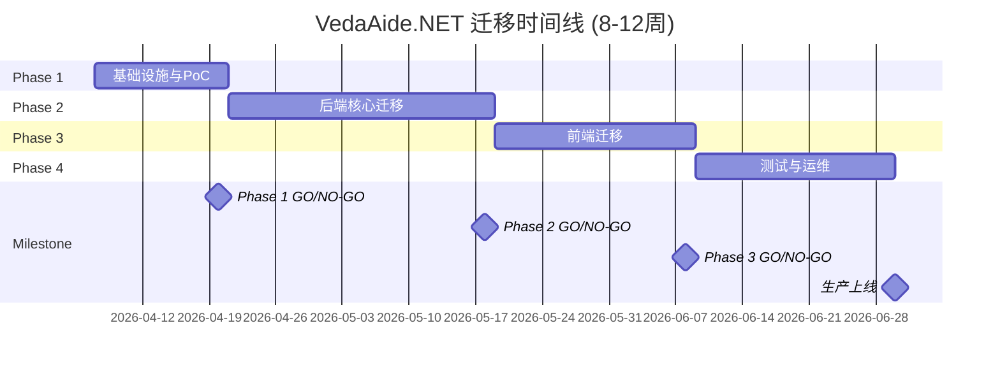

# VedaAide.NET 迁移分阶段实施总体计划

> **总体时长**: 8-12周 | **目标**: Next.js 15 + LangChain.js + React 19

---

## 执行摘要

本文档为 VedaAide.NET 迁移到 Next.js + LangChain 技术栈的完整路线图,拆分为4个独立阶段,每个阶段可单独验收。

### 总体目标

- **技术现代化**: 从 .NET 10 迁移到 Next.js 15,提升开发效率
- **AI生态优化**: 采用 LangChain.js 获取更丰富的工具链
- **功能对等**: 100%迁移现有功能(RAG + Agent + MCP + 幻觉检测)
- **质量提升**: 测试覆盖率 80%+,性能基准达标
- **生产就绪**: CI/CD自动化,备份恢复机制完善

### 核心原则

1. **分阶段交付**: 每个阶段独立验收,及早发现问题
2. **最佳实践**: 所有实现遵循业界最佳实践
3. **AI可执行**: 每个文档可直接用于 GitHub Issue,指导AI开发
4. **全程验证**: 每个阶段包含GO/NO-GO决策标准
5. **风险可控**: 明确风险评估和缓解措施

### 迁移策略选择 ⭐ 新增

本计划采用**渐进式迁移（Progressive Migration）**，避免"大爆炸"式切换的高风险。

#### 方案对比

| 策略 | 描述 | 优点 | 缺点 | 适用场景 |
|-----|------|------|------|---------|
| **大爆炸迁移** | 完成所有开发后一次性切换 | 架构清晰、无中间状态 | 风险高、回滚困难 | 小型项目 |
| **绞杀者模式** | 逐步用新系统替换旧系统功能 | 风险低、可逐步验证 | 双系统并存复杂度高 | 大型遗留系统 |
| **渐进式迁移** | 分阶段重写 + 快速切换 | 平衡风险与复杂度 | 需要严格计划 | **本项目采用** |

#### 本项目采用的策略

**Phase 1-3: 全功能重写（隔离开发）**
- Next.js 项目独立开发，不与 .NET 系统集成
- Phase 2 完成后即有可独立运行的最小系统
- 优点：架构清晰、开发效率高
- 缺点：需要 Phase 4 数据迁移

**Phase 4: 数据迁移 + 快速切换**
- 使用 T16.5 数据迁移脚本一次性迁移历史数据
- 设置停机窗口（建议 2-4 小时）
- 切换 DNS/负载均衡到新系统
- 保留 .NET 系统作为回滚备份（1 周后下线）

**如果需要更保守的策略（可选）**：
1. **前端先行**：Next.js 前端 → .NET API（Phase 3 提前）
2. **后端渐进**：逐个 API 从 .NET 迁移到 Next.js
3. **流量切换**：使用特性开关（Feature Flags）逐步切换用户
4. **适用场景**：用户体量大（> 10万）、停机不可接受

**本项目选择渐进式的理由**：
- ✅ 用户体量适中，可接受短暂停机
- ✅ 技术栈差异大（.NET vs Node.js），部分重写更清晰
- ✅ Phase 2 的"垂直切片"策略已提前验证全栈链路
- ✅ 8-12 周的周期对于完全重写是合理的

---

## 阶段概览

### 🔑 阶段一: 基础设施与PoC (1-2周)

**目标**: 验证 Next.js + LangChain 与所有外部依赖的兼容性

**核心任务**:
- Next.js 15 项目初始化 (App Router + TypeScript strict)
- Prisma ORM 配置 (SQLite 本地开发)
- 环境配置管理（三种模式：本地开发/本地测试/部署）
- Ollama 集成 (本地开发：嵌入 + 聊天服务)
- Azure 服务集成验证 (本地可选、部署必需：OpenAI + Cosmos DB)
- 最小 RAG 工作流 (摄取 → 搜索 → 生成)
- Docker Compose 配置 (开发/测试/部署模式)
- Vitest 单元测试框架 (>60% 覆盖)

**环境模式说明** ⭐ 新增:
- **模式1**（推荐）: 本地 Ollama + SQLite，零依赖
- **模式2**（可选）: 本地测试 Azure 服务（通过环境变量）
- **模式3**（部署）: 使用 Managed Identity，无需凭证

**交付物**:
- ✅ 可运行的 Next.js 项目
- ✅ 所有外部服务连接 Demo
- ✅ 三模式配置文档
- ✅ 技术可行性报告

**GO/NO-GO 检查点**: 7项标准全部通过 → [详细计划](./phase1-plan.cn.md)

---

### 🛠️ 阶段二: 后端核心 + 最小可行性 UI (3-4周)

**目标**: 用 LangChain 重写 RAG/Agent/MCP 核心服务，并搭建极简聊天界面验证全栈链路

**核心策略**：采用"垂直切片"模式，而非传统的"先后端后前端"分层
- ✅ 实现完整的 LangChain 后端逻辑（无头服务）
- ✅ 同时搭建最小可行性 UI（极简聊天界面）
- ✅ 验证 Next.js 全栈链路（浏览器 → Server Actions → LangChain → LLM）

**核心任务**:
- **LangChain RAG 链迁移**: 
  - Document Loaders (Text/Markdown/PDF)
  - Text Splitters (递归/Markdown 分割)
  - Vector Store 集成 (SQLite + sqlite-vec)
  - RetrievalQAChain 构建
  - **⭐ Re-ranking（重排序）集成** - 提升检索质量
- **双层去重服务**: 
  - Layer 1: SHA-256 哈希去重
  - Layer 2: 向量相似度去重 (threshold=0.95)
- **双层幻觉检测**: 
  - Layer 1: 答案嵌入 vs 知识库相似度
  - Layer 2: LLM 自校验 (可配置)
- **Agent 编排**: 
  - **⭐ Agent 协议定义** - SK 到 LangChain 映射
  - LangGraph ReAct Agent
  - 自定义工具 (search_knowledge_base, ingest_document)
- **MCP 协议**: 
  - MCP Server: 暴露 VedaAide 工具
  - MCP Client: FileSystem + Blob Storage 连接器
- **Prompt 版本管理**: CRUD API + 动态加载
- **⭐ Server Actions 与流协议**: 端到端类型安全 + SSE 流式响应
- **⭐ 最小可行性 UI**: 极简聊天界面 + 文档摄取表单

**交付物**:
- ✅ 完整的后端服务代码
- ✅ **可运行的聊天界面（验证流式响应）**
- ✅ API 文档 (OpenAPI 3.0)
- ✅ 单元测试 (>75% 覆盖)

**GO/NO-GO 检查点**: 11项标准全部通过 → [详细计划](./phase2-plan.cn.md)

---

### 🎨 阶段三: 前端完善与增强 (2-3周)

**目标**: 在 Phase 2 最小可行性 UI 的基础上，完善前端功能并迁移所有 Angular 19 特性

**Phase 2 遗留**: 已有极简聊天界面和文档摄取表单
**Phase 3 目标**: 完善 UI 组件库、管理页面、复杂交互、性能优化

**核心任务**:
- **UI 组件库**: shadcn/ui + Tailwind CSS
- **页面路由**: 
  - `/` - 聊天页（增强版：来源引用、Agent 思考过程、幻觉警告）
  - `/ingest` - 文档摄取页（完善版：拖放上传、历史记录）
  - `/prompts` - Prompt 管理页（新增）
  - `/evaluation` - 评估报告页（新增）
- **状态管理**: 
  - Zustand (客户端状态)
  - **⭐ TanStack Query (服务端状态)** - 处理长时间 SSE 流
- **⭐ SSE 流增强**: 
  - 高延迟网络环境下的稳定性测试（500ms RTT）
  - 边缘环境超时场景测试
- **类型安全 API**: tRPC 或 Server Actions
- **E2E 测试**: Playwright (所有关键流程)

**交付物**:
- ✅ 完整的前端代码
- ✅ 响应式 UI (Mobile + Desktop)
- ✅ Lighthouse 性能评分 >90

**GO/NO-GO 检查点**: 7项标准全部通过（含高延迟测试） → [详细计划](./phase3-plan.cn.md)

---

### ✅ 阶段四: 测试、数据迁移与运维 (2-3周)

**目标**: 测试、文档、数据迁移、CI/CD、运维配置完善

**核心任务**:
- **测试套件**: 
  - 单元测试 (>80% 覆盖)
  - 集成测试 (API + DB + External Services)
  - E2E 测试 (20+ 用例)
  - 性能基准测试 (k6, P95<2.5s)
  - 安全测试
- **API 文档**: OpenAPI 3.0 + Postman Collection
- **⭐ 数据迁移脚本**: 
  - 从 .NET 旧系统迁移对话历史、向量数据、Prompt 模板、用户配置
  - 数据完整性验证
  - 回滚方案
- **CI/CD Pipeline**: 
  - GitHub Actions (多阶段)
  - 自动部署 Staging/Prod
  - 版本管理 + 回滚机制
- **部署与运维**: 
  - Docker 生产优化 (<200MB)
  - Azure Container Apps 配置
  - 数据库备份/恢复
  - Application Insights 监控
- **文档整理**: 
  - 技术文档
  - 运维手册
  - 开发者文档
  - 迁移验收清单

**交付物**:
- ✅ 完整的测试套件
- ✅ 数据迁移成功（历史数据完整）
- ✅ 生产环境运行
- ✅ 迁移验收报告

**GO/NO-GO 检查点**: 6项标准全部通过 → [详细计划](./phase4-plan.cn.md)

---

## 总体时间线

---

## 总体成功标准

### 功能完整性 (10/10)

- ✅ 文档摄取 (Txt/Markdown/PDF)
- ✅ RAG 检索 + LLM 生成
- ✅ 双层去重 (Hash + 相似度)
- ✅ 双层幻觉检测 (向量 + LLM)
- ✅ Agent 编排 (ReAct + IRCoT)
- ✅ MCP Server (暴露工具)
- ✅ MCP Client (外部数据源)
- ✅ SSE 流式响应
- ✅ Prompt 版本管理
- ✅ AI 评估系统

### 性能指标 (4/4)

- ✅ RAG 查询延迟 (P95) < 2.5s
- ✅ 文档摄取吞吐量 > 40 docs/min
- ✅ 向量搜索 < 150ms
- ✅ Lighthouse 性能分 > 90

### 质量标准 (6/6)

- ✅ TypeScript strict 模式
- ✅ 测试覆盖率 > 80%
- ✅ ESLint + Prettier 规范
- ✅ 所有 API 端点文档化
- ✅ Docker 镜像 < 200MB
- ✅ CI/CD 自动化

---

## 风险管理

### 高风险项

| 风险 | 缓解措施 | 负责人 |
|-----|---------|--------|
| LangChain API 频繁变更 | 锁定稳定版本 0.3.x | Tech Lead |
| 向量存储性能不达标 | Phase 1 提前性能测试 | Backend Team |
| 生产环境故障 | 多实例 + 快速回滚机制 | DevOps Team |

### 中风险项

| 风险 | 缓解措施 | 负责人 |
|-----|---------|--------|
| MCP 协议不兼容 | Phase 1 早期 PoC 验证 | AI Team |
| E2E 测试片状失败 | 重试机制 + 等待元素 | QA Team |
| 团队技能差异 | Phase 1 包含培训任务 | Tech Lead |

---

## 文档导航

### 阶段计划文档

- 🔑 [阶段一计划: 基础设施与PoC](./phase1-plan.cn.md) - 1-2周
- 🛠️ [阶段二计划: 后端核心迁移](./phase2-plan.cn.md) - 3-4周
- 🎨 [阶段三计划: 前端迁移](./phase3-plan.cn.md) - 2-3周
- ✅ [阶段四计划: 测试与运维](./phase4-plan.cn.md) - 2-3周

### 支撑文档

- 📊 [可行性分析](./feasibility-analysis.cn.md) - 技术栈对照、成本效益分析
- 🏗️ [VedaAide.NET 系统设计](../../VedaAide.NET/docs/designs/system-design.cn.md) - 原架构参考

---

## GitHub Issues 生成指南

每个阶段计划文档均包含GitHub Issue模板,可直接复制使用:

1. **阅读阶段计划**: 从 Phase 1 开始,逐阶段阅读
2. **复制 Issue 模板**: 每个计划文档末尾有完整模板
3. **创建 GitHub Issue**: 将模板粘贴到项目 Issue
4. **指派团队成员**: 按技能分工指派
5. **追踪进度**: 勾选任务清单,更新状态

---

## 附录: 技术栈对照表

| 层级 | VedaAide.NET | VedaAide.js (Next.js) |
|-----|-------------|---------------------|
| **后端框架** | .NET 10 + ASP.NET Core | Next.js 15 (App Router + Server Actions) |
| **AI 编排** | Semantic Kernel 1.73 | LangChain.js v0.3+ |
| **数据访问** | EF Core 10 + SQLite | Prisma ORM + SQLite |
| **API 层** | HotChocolate 15 (GraphQL) + REST | tRPC (type-safe) / Server Actions |
| **前端** | Angular 19 (Standalone + Signals) | React 19 + Next.js (App Router + RSC) |
| **向量存储** | sqlite-vec | sqlite-vec |
| **云存储** | Azure Cosmos DB (元数据) | Azure Cosmos DB (元数据) |
| **部署** | Docker Compose / Azure Container Apps | Docker / Azure Container Apps |

---

**文档维护**: VedaAide迁移团队  
**审阅状态**: ✅ 已审阅  
**更新日期**: 2026-04-07  
**下一步**: 阅读 [可行性分析](./feasibility-analysis.cn.md) → 开始 [Phase 1](./phase1-plan.cn.md)
