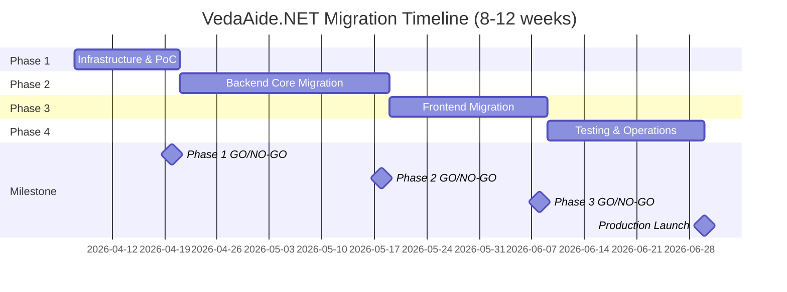

# VedaAide.NET Phased Migration Plan

> **Total Duration**: 8-12 weeks | **Target**: Next.js 15 + LangChain.js + React 19

---

## Executive Summary

This document provides the complete roadmap for migrating VedaAide.NET to the Next.js + LangChain technology stack, divided into 4 independent phases, each with standalone acceptance criteria.

### Overall Objectives

- **Technology Modernization**: Migrate from .NET 10 to Next.js 15, improving development efficiency
- **AI Ecosystem Optimization**: Adopt LangChain.js for richer toolchain
- **Feature Parity**: 100% migration of existing features (RAG + Agent + MCP + Hallucination Detection)
- **Quality Enhancement**: 80%+ test coverage, performance benchmarks met
- **Production Readiness**: CI/CD automation, backup/recovery mechanisms complete

### Core Principles

1. **Phased Delivery**: Each phase independently accepted, early issue detection
2. **Best Practices**: All implementations follow industry best practices
3. **AI-Actionable**: Each document directly usable as GitHub Issue, guiding AI development
4. **Full Verification**: Each phase includes GO/NO-GO decision criteria
5. **Risk Control**: Clear risk assessment and mitigation measures

---

## Phase Overview

### 🔑 Phase 1: Infrastructure & Proof of Concept (1-2 weeks)

**Goal**: Validate Next.js + LangChain compatibility with all external dependencies

**Core Tasks**:
- Next.js 15 project initialization (App Router + TypeScript strict)
- Prisma ORM configuration (SQLite for dev/prod)
- Ollama integration (embedding + chat service)
- Azure service integration (OpenAI + Cosmos DB + Blob Storage)
- Minimal RAG workflow (ingest → search → generate)
- Docker Compose configuration
- Vitest unit test framework (>60% coverage)

**Deliverables**:
- ✅ Runnable Next.js project
- ✅ All external service connection demos
- ✅ Technical feasibility report

**GO/NO-GO Checkpoint**: 7 criteria all pass → [Detailed Plan](./phase1-plan.en.md)

---

### 🛠️ Phase 2: Backend Core Migration (3-4 weeks)

**Goal**: Rewrite RAG/Agent/MCP core services with LangChain

**Core Tasks**:
- **LangChain RAG Chain Migration**: 
  - Document Loaders (Text/Markdown/PDF)
  - Text Splitters (Recursive/Markdown splitting)
  - Vector Store integration (SQLite + sqlite-vec)
  - RetrievalQAChain construction
- **Dual-layer Deduplication Service**: 
  - Layer 1: SHA-256 hash deduplication
  - Layer 2: Vector similarity deduplication (threshold=0.95)
- **Dual-layer Hallucination Detection**: 
  - Layer 1: Answer embedding vs knowledge base similarity
  - Layer 2: LLM self-verification (configurable)
- **Agent Orchestration**: 
  - LangGraph ReAct Agent
  - Custom tools (search_knowledge_base, ingest_document)
  - IRCoT strategy implementation
- **MCP Protocol**: 
  - MCP Server: Expose VedaAide tools
  - MCP Client: FileSystem + Blob Storage connectors
- **Prompt Version Management**: CRUD API + dynamic loading

**Deliverables**:
- ✅ Complete backend service code
- ✅ API documentation (OpenAPI 3.0)
- ✅ Unit tests (>75% coverage)

**GO/NO-GO Checkpoint**: 7 criteria all pass → [Detailed Plan](./phase2-plan.en.md)

---

### 🎨 Phase 3: Frontend Migration (2-3 weeks)

**Goal**: Angular 19 → React 19 + Next.js App Router

**Core Tasks**:
- **UI Component Library**: shadcn/ui + Tailwind CSS
- **Page Routes**: 
  - `/` - Chat page (default)
  - `/ingest` - Document ingestion page
  - `/prompts` - Prompt management page
  -  `/evaluation` - Evaluation report page
- **State Management**: Zustand (chat messages + ingestion state)
- **SSE Streaming Response**: EventSource API + word-by-word display
- **Type-safe API**: tRPC or Server Actions
- **E2E Tests**: Playwright (all key flows)

**Deliverables**:
- ✅ Complete frontend code
- ✅ Responsive UI (Mobile + Desktop)
- ✅ Lighthouse performance score >90

**GO/NO-GO Checkpoint**: 6 criteria all pass → [Detailed Plan](./phase3-plan.en.md)

---

### ✅ Phase 4: Testing & Operations (2-3 weeks)

**Goal**: Complete testing, documentation, CI/CD, and ops configuration

**Core Tasks**:
- **Test Suite**: 
  - Unit tests (>80% coverage)
  - Integration tests (API + DB + External Services)
  - E2E tests (20+ cases)
  - Performance benchmark testing (k6, P95<2.5s)
  - Security testing
- **API Documentation**: OpenAPI 3.0 + Postman Collection
- **CI/CD Pipeline**: 
  - GitHub Actions (multi-stage)
  - Automated deployment to Staging/Prod
  - Version management + rollback mechanism
- **Deployment & Operations**: 
  - Docker production optimization (<200MB)
  - Azure Container Apps configuration
  - Database backup/recovery
  - Application Insights monitoring
- **Documentation Cleanup**: 
  - Technical documentation
  - Operations manual
  - Developer documentation
  - Migration acceptance checklist

**Deliverables**:
- ✅ Complete test suite
- ✅ Production environment running
- ✅ Migration acceptance report

**GO/NO-GO Checkpoint**: 6 criteria all pass → [Detailed Plan](./phase4-plan.en.md)

---

## Overall Timeline

---

## Overall Success Criteria

### Functional Completeness (10/10)

- ✅ Document ingestion (Txt/Markdown/PDF)
- ✅ RAG retrieval + LLM generation
- ✅ Dual-layer deduplication (Hash + Similarity)
- ✅ Dual-layer hallucination detection (Vector + LLM)
- ✅ Agent orchestration (ReAct + IRCoT)
- ✅ MCP Server (expose tools)
- ✅ MCP Client (external data sources)
- ✅ SSE streaming response
- ✅ Prompt version management
- ✅ AI evaluation system

### Performance Metrics (4/4)

- ✅ RAG query latency (P95) < 2.5s
- ✅ Document ingestion throughput > 40 docs/min
- ✅ Vector search < 150ms
- ✅ Lighthouse performance score > 90

### Quality Standards (6/6)

- ✅ TypeScript strict mode
- ✅ Test coverage > 80%
- ✅ ESLint + Prettier standards
- ✅ All API endpoints documented
- ✅ Docker image < 200MB
- ✅ CI/CD automation

---

## Risk Management

### High-Risk Items

| Risk | Mitigation | Owner |
|------|-----------|-------|
| LangChain API frequent changes | Lock stable version 0.3.x | Tech  Lead |
| Vector storage performance issues | Phase 1 early performance testing | Backend Team |
| Production environment failure | Multiple instances + fast rollback | DevOps Team |

### Medium-Risk Items

| Risk | Mitigation | Owner |
|------|-----------|-------|
| MCP protocol incompatibility | Phase 1 early PoC validation | AI Team |
| E2E test flakiness | Retry mechanism + wait for elements | QA Team |
| Team skill differences | Phase 1 includes training tasks | Tech Lead |

---

## Documentation Navigation

### Phase Plan Documents

- 🔑 [Phase 1 Plan: Infrastructure & PoC](./phase1-plan.en.md) - 1-2 weeks
- 🛠️ [Phase 2 Plan: Backend Core Migration](./phase2-plan.en.md) - 3-4 weeks
- 🎨 [Phase 3 Plan: Frontend Migration](./phase3-plan.en.md) - 2-3 weeks
- ✅ [Phase 4 Plan: Testing & Operations](./phase4-plan.en.md) - 2-3 weeks

### Supporting Documents

- 📊 [Feasibility Analysis](./feasibility-analysis.en.md) - Tech stack comparison, cost-benefit analysis
- 🏗️ [VedaAide.NET System Design](../../VedaAide.NET/docs/designs/system-design.en.md) - Original architecture reference

---

## GitHub Issues Generation Guide

Each phase plan document includes a GitHub Issue template, ready to copy and use:

1. **Read Phase Plans**: Start from Phase 1, read phase-by-phase
2. **Copy Issue Template**: Each plan document has a complete template at the end
3. **Create GitHub Issue**: Paste template into project Issue
4. **Assign Team Members**: Assign by skill set
5. **Track Progress**: Check off task checklist, update status

---

## Appendix: Technology Stack Comparison Table

| Layer | VedaAide.NET | VedaAide.js (Next.js) |
|-------|-------------|---------------------|
| **Backend Framework** | .NET 10 + ASP.NET Core | Next.js 15 (App Router + Server Actions) |
| **AI Orchestration** | Semantic Kernel 1.73 | LangChain.js v0.3+ |
| **Data Access** | EF Core 10 + SQLite | Prisma ORM + SQLite |
| **API Layer** | HotChocolate 15 (GraphQL) + REST | tRPC (type-safe) / Server Actions |
| **Frontend** | Angular 19 (Standalone + Signals) | React 19 + Next.js (App Router + RSC) |
| **Vector Storage** | sqlite-vec | sqlite-vec |
| **Cloud Storage** | Azure Cosmos DB (metadata) | Azure Cosmos DB (metadata) |
| **Deployment** | Docker Compose / Azure Container Apps | Docker / Azure Container Apps |

---

**Document Maintainer**: VedaAide Migration Team  
**Review Status**: ✅ Reviewed  
**Last Updated**: 2026-04-07  
**Next Step**: Read [Feasibility Analysis](./feasibility-analysis.en.md) → Start [Phase 1](./phase1-plan.en.md)
